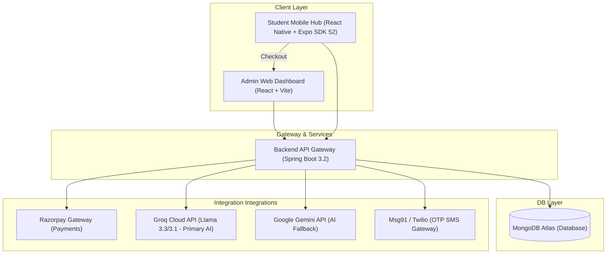
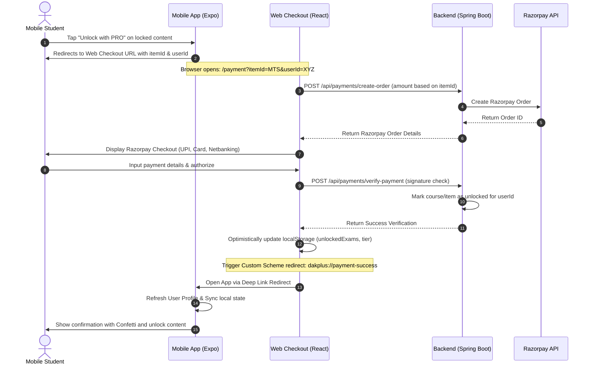
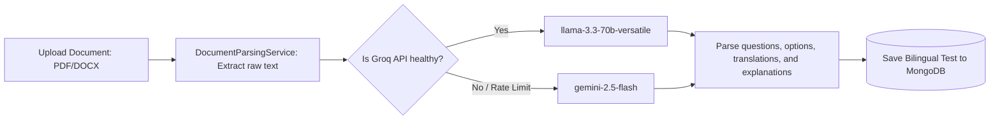

# DAKPlus: Comprehensive Features and Operational Flows Guide

This document provides a detailed breakdown of all features, operational flows, business rules, and security mechanisms implemented across the **DAKPlus Monolith** platform (Spring Boot Backend, React Web Frontend, and React Native Mobile App).

---

## 🏗️ Platform Overview & Architecture

DAKPlus is an elite preparation ecosystem for Indian Postal Service examinations (MTS, Postman/Mail Guard, and PA/SA). 

---

## 🔑 1. User Authentication & Authorization Flow

DAKPlus uses passwordless OTP-based authentication to maximize student onboarding speed and account security.

### Operational Flow:
1. **Request OTP**: Student enters their mobile number in the mobile application.
2. **OTP Dispatch**: The mobile client sends a request to the backend `/api/auth/send-otp`. The backend generates a secure 6-digit code, saves it with an expiration timestamp, and triggers Msg91 (or Twilio fallback) to send the SMS.
3. **Verify OTP**: The user inputs the 6-digit code. The mobile app calls `/api/auth/verify-otp`.
4. **Token Generation**: On success, the backend returns a JSON Web Token (JWT) containing user identity, subscription details, and role.
5. **Secure Storage**: The JWT and parsed user profile are stored on the device using `expo-secure-store` to keep the user signed in.

### Authorization Roles:
- **`STUDENT`**: Can attempt tests, view syllabus files, buy subscriptions, and track their performance.
- **`TEACHER`** / **`ADMIN`**: Case-insensitive access to the **Instructor Toolbar** to upload documents, add tests, view analytics, and manage topics.

---

## 💰 2. Course Batches & Tiered Pricing

The platform splits study materials and mock exams into four specific courses:

| Course ID | Full Name | Target Audience | Target Price |
| :--- | :--- | :--- | :--- |
| **`MTS`** | Multi-Tasking Staff Exam | MTS Aspirants (Target 2026 Batch) | **₹399** |
| **`PMMG`** | Postman & Mail Guard | Paper 1 & 2 Candidates | **₹599** |
| **`PASA`** | Postal Assistant / Sorting Assistant | Advanced Candidates (Target 2026 Batch) | **₹799** |
| **`COMBINED`**| Combined Pro Course | Access to all three courses above | **₹999** |

---

## 🔒 3. Premium Content & Mock Test Access Control

To protect intellectual property while giving users a preview, DAKPlus employs a hybrid locking mechanism.

### A. Mock Test Locking Logic (`FREE SAMPLE` vs. `PRO`)
- **Rule**: For any given course, the **first two tests** (sorted by creation date, oldest first) are designated as **Free Samples**.
- **Free Sample Behavior**: Any user (including free accounts) can attempt these tests. They are highlighted with a green `[FREE SAMPLE]` badge, and clicking them starts the test immediately.
- **Pro Lock Behavior**: All tests after the first two are marked as `[PRO]`. They are visually locked (orange padlock icon, greyed-out card) for non-paying users.
- **Bypass / Unlock Rules**: A test is unlocked if:
  1. The user's role is `ADMIN` or `TEACHER`.
  2. The user has a global `PREMIUM` subscription tier (obtained via the `COMBINED` package).
  3. The test's matching course ID (e.g. `MTS`, `PMMG`, `PASA`) is present in the user's `unlockedExams` array.
  4. The user has a recorded transaction matching this specific test ID in their purchase history.

### B. Syllabus & Study Material Gating
- **PDF Locking**: Syllabus PDFs and subtopic manuals are gated.
- **Bypass Check**: Clicking "View Syllabus PDF" calls `isCourseUnlocked(courseId)`. If the user does not own the course, the app shows a premium lock alert: *"Syllabus PDFs are only available for PRO members. Would you like to unlock this course?"* which redirects them to the checkout page.

---

## 💳 4. Secure Payment & Deep Link Return Flow

Payments are processed through a web-based Razorpay checkout to maintain cross-platform compliance and security.

---

## 📋 5. Transaction & Order History

Students can view all their financial transactions and purchases transparently on both platforms:
- **Web Platform**: Accessible under the "Order History" or "Transaction History" sections of the Student Dashboard.
- **Mobile Platform**: Added to the Side Menu (Drawer Navigation) as **"My Purchases"** (navigating to `MyPurchasesScreen.js`). It shows:
  - Course or Test item name
  - Paid Amount
  - Transaction Reference ID
  - Date and Time of purchase
  - Current Status (Success / Failed)

---

## ✍️ 6. Interactive Mock Test Environment

The test taking environment is optimized for student concentration and exam simulation.

### A. Focus Mode & Exit Guards
- **Distraction-Free**: Hides all header menus, side drawer gestures, and navigation options when the test starts.
- **Exit Guards**: If a student attempts to leave the test (via the Android hardware back button or top-left close gesture), a confirmation alert is intercepted:
  > **Confirm Exit**  
  > *"Are you sure you want to exit? Your current progress on this mock test will be lost."*
- If confirmed, the test terminates without submission; otherwise, the user remains focused on the exam.

### B. Bilingual Support
- Every mock test supports dual languages: **English** and **Hindi**.
- Students can toggle between languages instantly for any question without reloading the test page.

### C. Submit Confirmation Warnings
- Before the final submit is executed, the app checks if the user has left any questions unanswered.
- **Warning Alert**:
  > **Submit Exam?**  
  > *"You have [X] unanswered question(s). Are you sure you want to submit your exam now?"*

---

## 🔍 7. Content Search & Highlight Engine

To help students easily locate specific questions, explanations, or syllabus topics:
- **Search Highlighting**: Matches are highlighted using dynamic regex matching. Every occurrence of the search query in titles, question bodies, and question explanations is wrapped in highlighted markup (`<mark>` on web, distinct background color styling on mobile).
- **Matching Questions List**: When searching in the dashboard, the interface doesn't just show matching test cards; it dynamically displays a collapsible **"Matching Questions"** accordion below the cards, listing the exact question texts, options, and explanations matching the query.

---

## 🤖 8. AI-Powered Question Extraction Flow

Instructors can instantly create exams by uploading study sheets, PDFs, or syllabus books.

### Operational Rules:
1. **Model Routing**: Groq Cloud is configured as the primary AI engine using `llama-3.3-70b-versatile` (for deep question extraction) and `llama-3.1-8b-instant` (for chat assistants).
2. **Fallbacks**: If the Groq API fails, returns an error, or hits rate limits, the Java backend automatically catches the exception and routes the request to Google Gemini (`gemini-2.5-flash`) to ensure uninterrupted functionality.
3. **Robust Input Parsing**: Handles raw file uploads without explicit content-type headers by inspecting binary signatures and file headers, protecting against mobile upload anomalies.
4. **Volume Support**: The model prompt is tuned to extract up to **100 questions** in a single parsing batch.

---

## 🛡️ 9. System Security & Copy Protection

To prevent sharing, leakages, or distribution of premium practice questions and study guides:
- **Global Capture Blocking**: Integrated `expo-screen-capture` on the mobile root.
- **Android Level Protection**: Calls the native window manager to inject `WindowManager.LayoutParams.FLAG_SECURE`.
  - **Screenshots**: Completely blocked. Pressing the screenshot button combinations displays a system toast: *"Can't take screenshot due to security policy."*
  - **Screen Recording**: Blocked. Recording software captures only a completely black screen for the DAKPlus app window.
  - **Recent Apps Preview**: Blurs or blanks out the app screen preview in the OS multitasking carousel.
- **iOS Level Protection**: Native system obfuscates/blurs the screen if recording is initiated or if the app is put in the background.

---

## 📦 10. Store Links & Production Builds

### Google Play Store Redirection
- The web landing page features a **Get it on Google Play** button linked to:
  `https://play.google.com/store/apps/details?id=com.kiran2jd.dakplus`
- Clicking this on desktop or mobile redirects the student to the official App Store page.

### Production Environment Builds (EAS Build)
Builds are deployed using Expo SDK 52 for stability:
- **Testing APK (Preview Profile)**:
  - **Description**: Android package (`.apk`) for internal distribution and testing.
  - **Download Link**: [Download Testing APK](https://expo.dev/artifacts/eas/dN87Qjkh2uu_KE9jp0tA2Y5UOXnbL_KQ_VqinZFNg3M.apk)
- **App Store AAB (Production Profile)**:
  - **Description**: Signed Android App Bundle (`.aab`) ready to upload directly to the Google Play Console under version code `6`.
  - **Download Link**: [Download Production AAB](https://expo.dev/artifacts/eas/3Ess3-0N7kNBlpTWEOonfnvh9QEhQlXO-m41IjQn4cs.aab)
